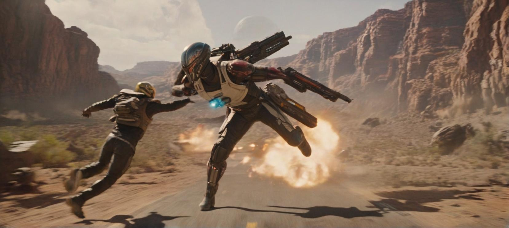

# artificialguybr/cinematic.redmond Cog model

This is an implementation of the model [artificialguybr/cinematic.redmond](https://huggingface.co/artificialguybr/CinematicRedmond-SDXL) as a Cog model. [Cog packages machine learning models as standard containers.](https://github.com/replicate/cog)

Run predictions:

    cog predict -i prompt="A high-speed, cinematic film still of an intergalactic bounty hunter in hot pursuit of their target, the frame alive with a kinetic, adrenaline-fueled energy as the two combatants weave through the hazardous terrain of an alien world."

